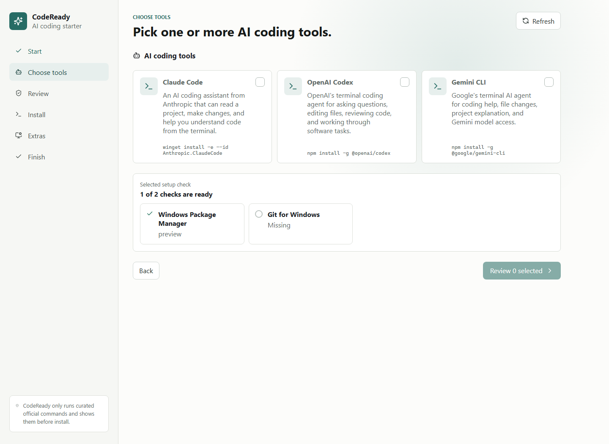
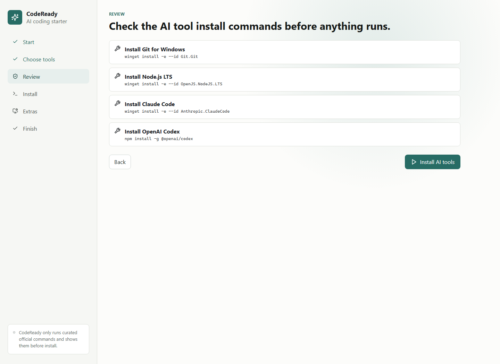
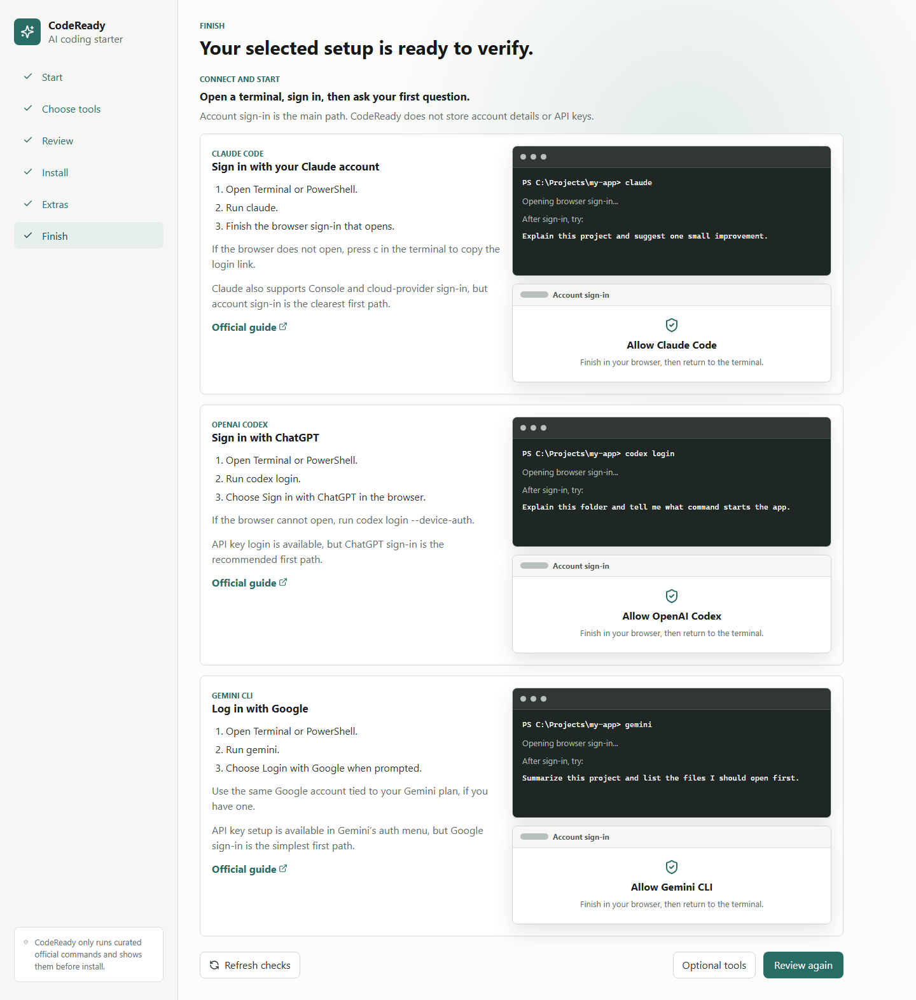
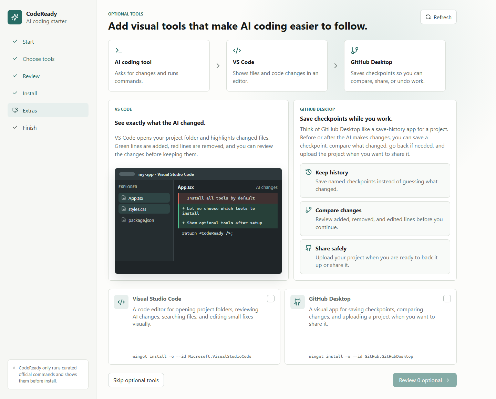

# CodeReady

CodeReady is a Windows-first setup wizard for installing AI coding tools without memorizing Node.js, npm, PATH, terminal, or package-manager commands.

The app uses a curated catalog of official install recipes. It shows the exact commands before running them, verifies the installed commands afterward, and does not store API keys or provider login credentials.

## Website

Project website: https://showmethecold.github.io/CodeReady/

Download the Windows installer from the [Releases page](https://github.com/showmethecold/CodeReady/releases).

## What CodeReady helps with

- Pick the AI coding tools you want to install.
- Check only the system pieces needed for those tools.
- Review the exact install commands before anything runs.
- Connect each tool to your account and learn the first command to try.
- Optionally add VS Code and GitHub Desktop so you can review changes and save checkpoints.

## Walkthrough

Choose one or more AI coding tools. Tools that are already installed are shown as ready.



Review the commands before CodeReady runs them.



After install, CodeReady shows how to sign in and start each selected tool.



Optional tools explain how VS Code helps you review AI changes and how GitHub Desktop helps you save checkpoints.



## v1 Tools

- Claude Code
- OpenAI Codex
- Gemini CLI
- VS Code, optional
- GitHub Desktop, optional

## Development

```powershell
npm install
npm run dev
npm run tauri dev
```

Run checks:

```powershell
npm test
npm run build
cd src-tauri
cargo test
```
